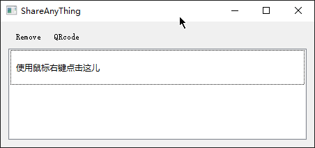
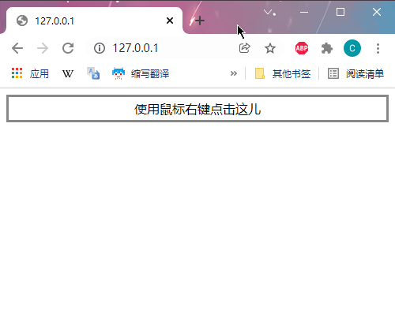
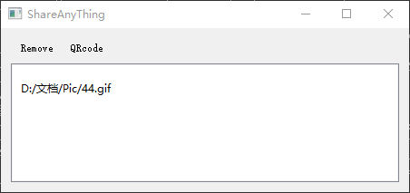
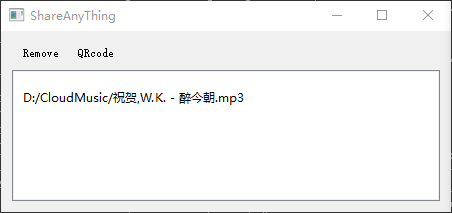
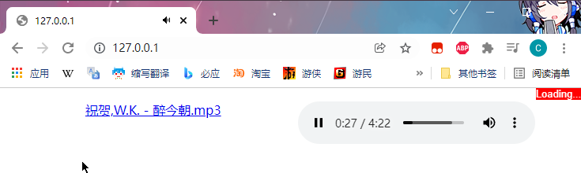
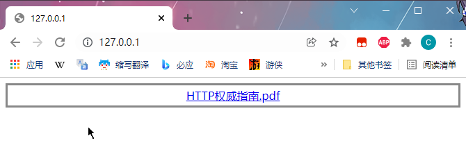
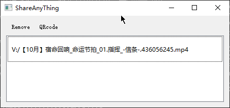
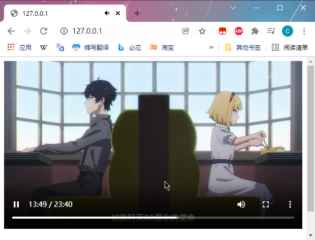
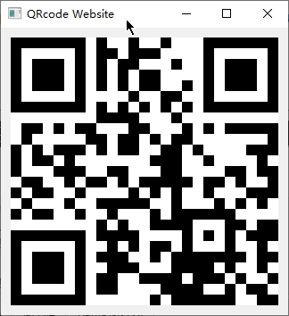

# ShareAny

用于共享一些文件.

## 开发计划

* [x] 上传功能
* [x] 文本
* [x] 图片
* [x] 音乐
* [x] 文件
* [x] 视频
* [x] 点击文本复制
* [x] HTTPS
* [x] 随机链接防偷窥
* [x] 自由更改端口
* [x] 系统托盘常驻
* [ ] 自定义快捷键（默认 Ctrl_Space 从剪贴板添加 Ctrl_D清空)
* [ ] 组 （一次粘贴的文件在一个控件中显示）
* [ ] 文件类型图标 (文件类型显示时添加图标)

---

* [ ] html 从文件建立页面

## 更新说
### 20230330
1. 添加上传文本框 上传完成后本地弹出提示 并将内容保存到剪贴板
### 20230329
1. 修复上传文件文件名 有包含中文字符 保存到本地时 文件名乱码
### 20220801

1. 修复Windows 未开启 区域语言 使用Utf8全球支持 导致的乱码问题

### 20220209

1. 添加多网卡二维码切换
2. 修复下载中文名称文件无法

### 20220110

1. 兼容多系统Linux MacOS Windows

### 20220108

1. 修复粘贴文字分段
2. 修复时好时坏的复制功能
3. 添加HTTPS
4. 添加上传功能（设置中可修改保存文件夹）

### 20220107

1. 添加了随机链接防偷窥
2. 修复设置修改端口应用后有多个服务的bug

### 20220106

1. 剪切板图片可以直接右键点击添加了（虽然还是自动保存到了TEMP文件夹）
2. 端口可以自由更改了，并且记住（改了之后下次开启软件还是这个端口）
3. 修改了网页文本复制，更大的文本框更大的按钮

## 使用说明

### 文本

使用鼠标右键点击

### 图片

拖拽进入

### 音乐

拖拽进入

### 文件

拖拽进入

### 视频

在线播放只支持mp4

### 扫码访问

使用手机扫码访问web页面懒得输入局域网ip

