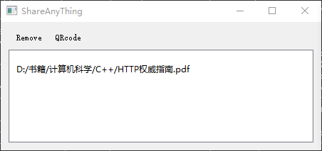

# ShareAny

用于共享一些文件.

## 开发进度

* [ ] 上传功能
* [X] 文本
* [X] 图片
* [X] 音乐
* [X] 文件
* [X] 视频
* [ ] 点击文本复制

## 使用说明

### 文本
使用鼠标右键点击
   

### 图片
   拖拽进入

   
   
### 音乐
   拖拽进入

   
   
### 文件
   拖拽进入

   
   
### 视频
   在线播放只支持mp4

   
   
### 扫码访问
   使用手机扫码访问web页面懒得输入局域网ip
   
   
